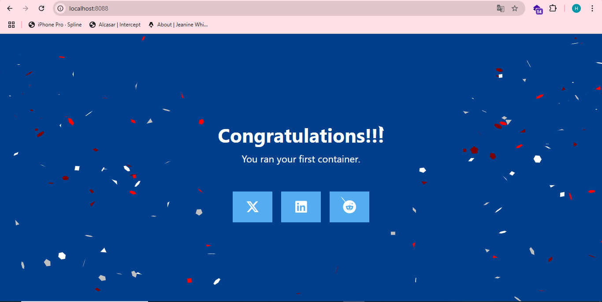
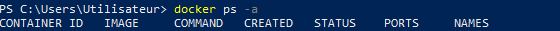
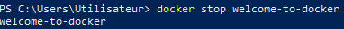
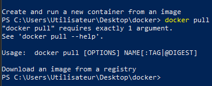
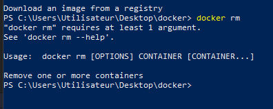

# Projet Docker : Welcome-to-Docker

Ce projet documente l'utilisation et l'exploration de l'image Docker "welcome-to-docker".

## Table des matières

1. [Installation et Configuration](#installation-et-configuration)
2. [Exécution du conteneur](#exécution-du-conteneur)
3. [Exploration de l'interface](#exploration-de-linterface)
4. [Commandes Docker de Base](#commandes-docker-de-base)
5. [Gestion des Conteneurs et Images](#gestion-des-conteneurs-et-images)
6. [Nettoyage de l'environnement](#nettoyage-de-lenvironnement)

### Vérification de l'installation Docker
Avant de commencer, vérifions que Docker est bien installé et configuré :


### Configuration initiale
Pour commencer, nous devons télécharger et exécuter l'image Docker :


## Exploration de l'interface

Une fois le conteneur démarré, nous pouvons accéder à l'interface via notre navigateur sur `http://localhost:8088` :

### Page d'accueil


### Navigation et fonctionnalités


## Commandes Docker de Base

### Vérification de l'installation

```bash
# Vérifier la version de Docker
docker --version
# Résultat : Docker version 27.4.0, build bde2b89

# Obtenir les informations détaillées sur Docker
docker info
```

### Commandes de base

```bash
# Lister les conteneurs en cours d'exécution
docker ps
```


```bash
# Lister toutes les images Docker
docker images
```


```bash
# Arrêter un conteneur
docker stop 
```


```bash
# Télécharger une image
docker pull [IMAGE_NAME]
```


### Construction et exécution du conteneur

```bash
# Exécuter un conteneur avec mappage de port


## Gestion des Conteneurs et Images

### Suppression des conteneurs

```bash
# Supprimer un conteneur spécifique
docker rm [CONTAINER_ID/NAME]
```


# Supprimer plusieurs conteneurs
docker rm [CONTAINER1_ID] [CONTAINER2_ID]

# Supprimer tous les conteneurs arrêtés
docker container prune

# Forcer la suppression d'un conteneur actif
docker rm -f [CONTAINER_ID/NAME]
```


### Suppression des images

```bash
# Supprimer une image spécifique
docker rmi [IMAGE_ID/NAME]


# Supprimer plusieurs images
docker rmi [IMAGE1_ID] [IMAGE2_ID]

# Supprimer toutes les images inutilisées
docker image prune

# Supprimer toutes les images non utilisées (incluant les images intermédiaires)
docker image prune -a

# Forcer la suppression d'une image
docker rmi -f [IMAGE_ID/NAME]
```

### Note importante
La commande `docker run` sans paramètres supplémentaires est incomplète. Il est nécessaire de spécifier au minimum :
- Une image à exécuter
- Les paramètres de configuration (ports, volumes, variables d'environnement, etc.) 

## Nettoyage de l'environnement

### État initial
```bash
PS C:\Users\Utilisateur> docker ps
CONTAINER ID   IMAGE                      COMMAND                  CREATED          STATUS          PORTS                  NAMES
07e31173c453   docker/welcome-to-docker   "/docker-entrypoint.…"   19 minutes ago   Up 19 minutes   0.0.0.0:8088->80/tcp   welcome-to-docker
```

### Procédure de nettoyage

1. Arrêt du conteneur :
```bash
docker stop welcome-to-docker
```

2. Suppression du conteneur :
```bash
docker rm welcome-to-docker
```

3. Suppression de l'image :
```bash
docker rmi docker/welcome-to-docker
```

### Vérification du nettoyage
```bash
# Vérifier qu'il n'y a plus de conteneurs en cours d'exécution
docker ps

# Vérifier qu'il n'y a plus de conteneurs arrêtés
docker ps -a

# Vérifier que l'image a été supprimée
docker images
``` 